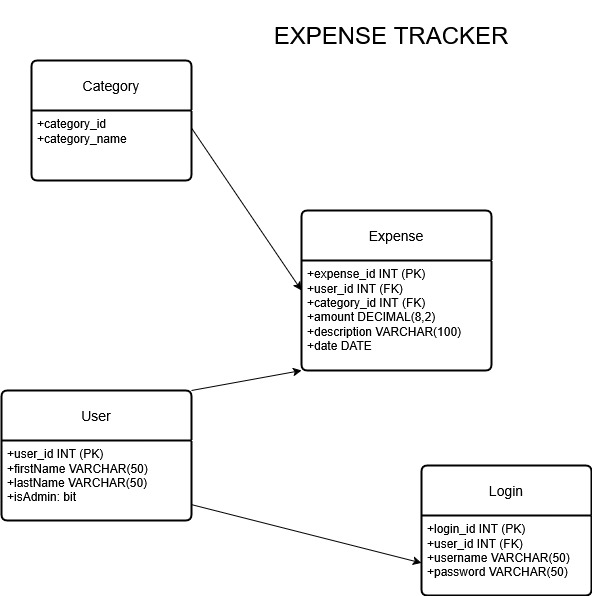
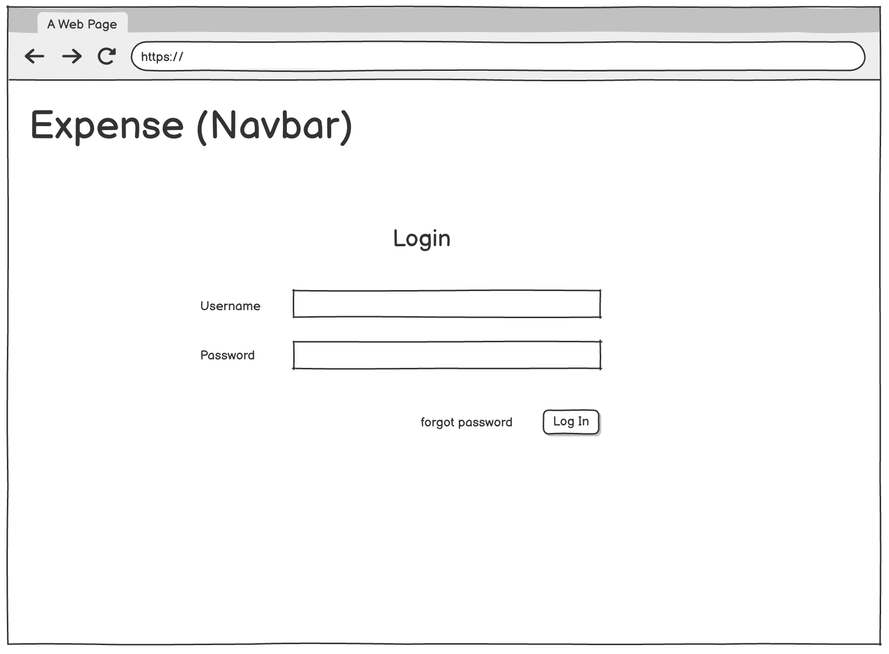
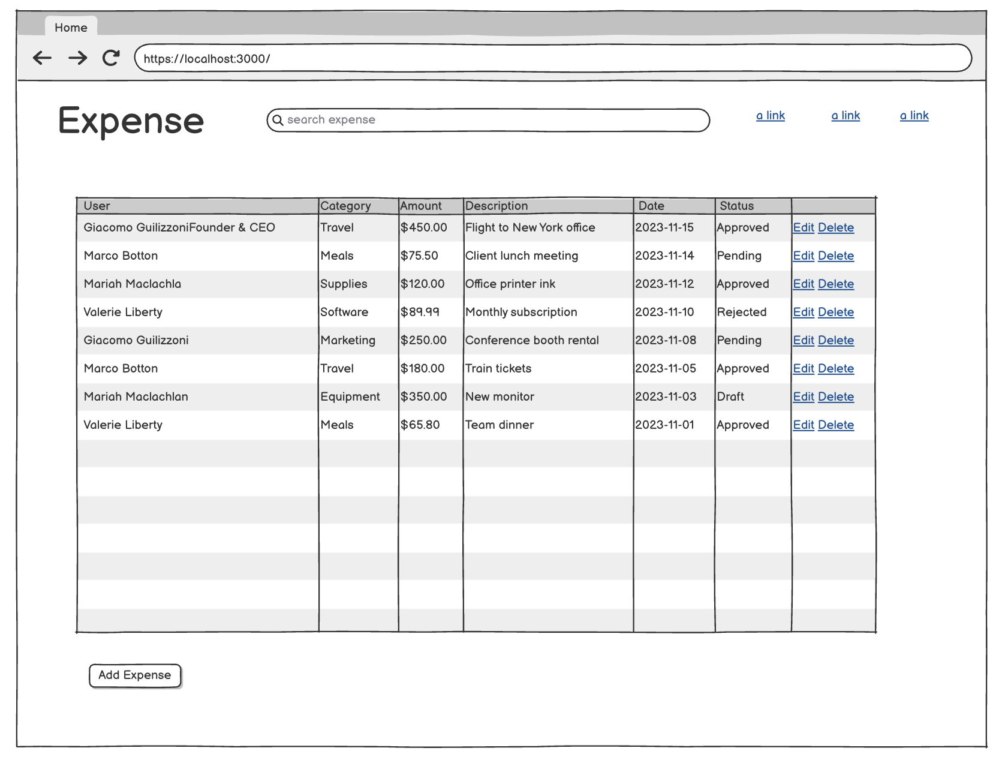
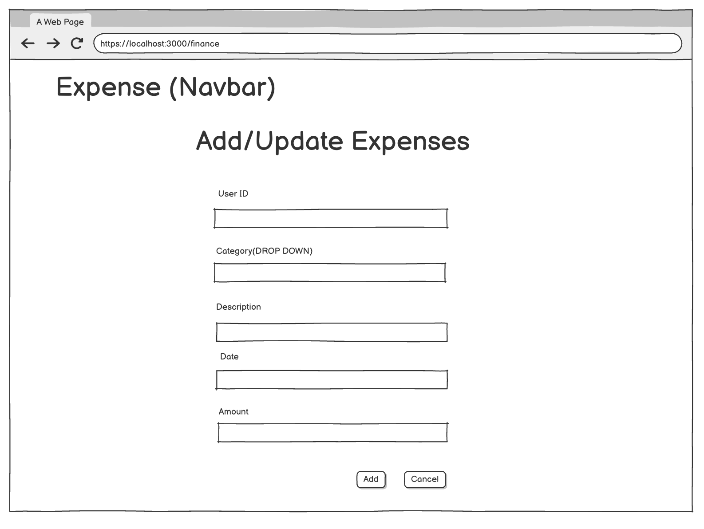
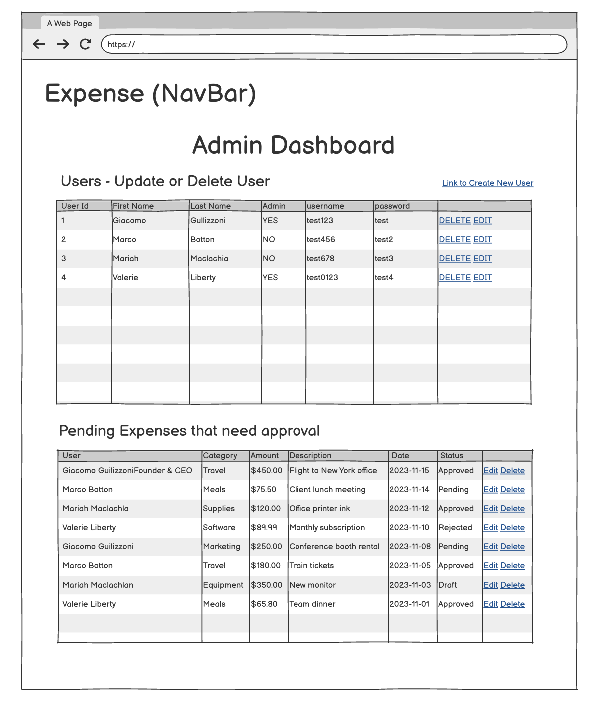

# Capstone-Git-Push-Mafia
#### Group 3: Matthew Maya (Developer 1), Kyle Box (Developer 2), Joey Tsui (Developer 3)

## Problem Statement:
Context: In many small to mid-sized companies, employees regularly incur business-related expenses that require tracking and approval — from travel costs to software purchases. These expenses are often submitted informally via spreadsheets, email threads, or paper receipts, leading to inconsistent workflows and administrative delays.

Core Problem: There is no streamlined, centralized platform for employees to submit and track their expenses, nor for managers to review and approve them efficiently. Current systems often lack role-based permissions and clarity, resulting in confusion over who submitted what, whether it was approved, or when reimbursement is expected.

Impact on Users: Employees feel uncertainty about the status of their expense submissions and often have to follow up manually.
- Managers lack visibility into spending trends and must deal with cluttered approval processes.
- Finance teams face difficulty reconciling records when expenses are scattered across tools or formats.

Opportunity for Solution: By building a centralized expense tracking application with role-based access (employees vs. managers), the expense reporting process can be made significantly more efficient and transparent.
- Employees will be able to easily submit, view, and update expenses.
- Managers will be able to approve or reject expenses from a dashboard.
- The organization as a whole will gain better control over its spending and improve the overall workflow between employees, management, and finance.

## Technical Solution

Overview of the Solution: We will build an expense tracking app for an individual company, which will divide operations between employees and managers based on permissions. Users create and update expenses which are then either approved, updated, or deleted by managers.

Key Features and Functionalities:

- findAllExpenses() - ADMIN & USER: finds a List of all expenses charged to the company displays relevant information ( associated employee, category, amount, description, date)
- findExpensesByCategory(categoryID) - ADMIN & USER: finds a List of all expenses (matching category id) charged to the company displays relevant information ( associated employee, amount, description, date)
- findExpenseByDateRange(startDate, endDate) - ADMIN & USER: finds a List of all expenses (within date range) charged to the company displays relevant information ( associated employee, amount, description, date)
- findByPriceRange(startPriceRange, endPriceRange) - ADMIN & USER: finds a List of all expenses (within price range) charged to the company displays relevant information ( associated employee, amount, description, date)
- findAllUsers() - ADMIN : finds a List of all users in the user database, displays relevant information: firstName, lastName, isAdmin, username, password
- addUser(user) - USER : adds a new user to the database
- deleteUser(userId)  - USER : removes a user from the database
- updateUser(userId) - ADMIN & USER : updates relevant user information (first_name, last_name, isAdmin (ADMIN only)
- addExpense(expense) - USER: adds expense to database, approved status is defaulted to false (can only be set to true by admin in updateApprovedStatus)
- updateExpense(expenseId) - ADMIN & USER: updates fields for an expense (except approvedStatus)
- updateApprovedStatus(expenseId) - ADMIN: alters approved status for an expense
- deleteExpense(expenseId) - ADMIN: removes an expense from the database

## Schema



## Wire Frame

### User Login page



### Home page


### Add/Edit form page


### admin dashboard


## User Scenarios:

Scenario 1: Peter, an employee of Bob's Construction Co., use the expense tracker to keep track of the amount spent on labor, materials, and equipment.
Scenario 2: Bob, the owner of Bob's Construction Co., logs onto his account to review Peter's pending expenses and can decide whether to add/update/delete that exact expense.
Technology Stack:

Front End: React and Typescript
Backend: Spring Boot for creating a secure REST API to handle adding and manipulating transactions as well as users to the database.
Database: MySQL to store user and transaction data
Authentication: JWT (JSON Web Token) for secure user login and role management.

## Glossary
Company
A business or organization that uses the expense tracking system to manage and monitor employee-submitted expenses. Each company may have multiple users with different permission levels (employees and managers).

User
Any individual who has access to the expense tracking platform. Users can be either employees or managers (admins), and their permissions vary based on role.

Employee
A user who submits expenses for approval. Employees can create, view, and edit their own expense entries but cannot approve or delete them.

Admin
A user with elevated privileges who oversees submitted expenses. Managers can view all expenses, approve or reject them, update user information, and remove entries from the system. All managers are users, but not all users are managers.

Expense
A record of a cost incurred by an employee that needs to be tracked and reviewed. Each expense includes details such as amount, category, date, description, approval status, and the user who submitted it.

Approval Status
A flag indicating whether a submitted expense has been approved by a manager. New expenses default to “unapproved” and can only be marked “approved” by a manager.

Category
A classification for organizing expenses (e.g., travel, equipment, meals, software). Categories help both employees and managers track spending trends and manage budgets.

## High Level Requirements
Manage 4 Database Tables (from the schema)/MySQL Database Management
Plan to meet requirement:
We will design and implement 4 independent database entities that represent different core concepts within the application(users, login, category, expense). This will involve creating the database and populating it with production and test data.

Spring Boot, MVC, JDBC, Testing, React
Plan to meet requirement:
We will implement the backend of the application using Spring Boot, utilizing the MVC (Model-View-Controller) architecture for organizing the application structure. The JDBC will be used for database connections and data transactions. For the frontend, we will build the UI with React and TypeScript,  ensuring it is responsive and functional. I will also write unit tests to ensure the back end is meeting requirements and obeying business rules

An HTML and CSS UI Built with React
Plan to meet requirement:
We will create the user interface using React, ensuring a clean, user-friendly design with HTML and CSS. We will follow modern web development practices, including responsive design to ensure the app works on both mobile and desktop devices. The layout will be organized and intuitive for users to login and view, create, update, and delete transactions.

Sensible Layering and Pattern Choices
Plan to meet requirement:
We will follow best practices for application architecture, utilizing layered design patterns. This includes separating the logic into distinct layers such as controller, service, and repository. We will ensure that the backend follows the Single Responsibility Principle and that the code is easy to maintain and scale.

A Full Test Suite that Covers the Domain and Data Layers
Plan to meet requirement:
We will implement a comprehensive test suite for the project. This will include unit tests for the domain layer (services and models) and the data layer (repositories and database interactions). Test doubles for each repository will be created that mimic their behavior.

Must Have at Least 2 Roles (Example: User and Admin)
Plan to meet requirement:
We will implement role-based access control using Spring Security. The system will have at least two roles: User and Admin. Users will be able to add themselves to the user database, update information, and remove themselves, as well as do the same operations for transactions (exceptions delete and update approval status). Admins will be able to set transactions to approved and delete transactions, as well as view user login information in case it needs to be reset.

## User Stories
Create an Expense
Goal: As an user, I want to add an expense for reimbursement
Plan to meet requirement: I will create a form where users can fill out detailed information of the expense such as user info, date, total amount, category, description.
Precondition: User must be logged in.
Post-condition: The expense will either be approved or rejected by an admin

Update an Expense
Goal: As a user, I want to edit an expense.
Plan to meet requirement: I will create a form with information populate from the existing expense that we are trying to edit, where user can input the correct information for the expense
Precondition: User must be logged in to update the expense
Post-condition: The expense will be reviewed by admin and will either be rejected or approved

Approve an Expense
Goal: As an Admin, I want to either approve or reject an expense
Plan to meet requirement: I will create an Admin Dashboard where the admin can go through a list of expenses that are pending have approve and reject button
Precondition: User must be logged in and as ADMIN
Post-condition: The expense will either be approved or rejected.

Delete an Expense
Goal: As an admin, I want to remove an expense
Plan to meet requirement: I will display a table with the list of expenses in it where it will have a button that allows the admins to remove an expense
Precondition: User must be logged in and as ADMIN

## Learning Goal
Learning Goal: I want to learn and use TypeScript for web application development.
Application: I will use TypeScript to build out the entire Front–End Development in our Expense Tracker Application
Research and Resources: TypeScript Documentation, Exercism TypeScript Course
Challenges: One challenge is that we have prior experience in using TypeScript. To address this issue we will be leaning towards reading documentations and watching videos on TypeScript, and use the TypeScript course to help understand.
Success Criteria: The front-end should be able to successfully display the necessary data and UI components of the Expense Tracker application.

## Class Diagram

```
src
├── main
│   └── java
│       └── learn
│           └── finance
│               ├── App.java
│
│               ├── controller
│               │   ├── UserController.java
│               │   ├── ExpenseController.java
│               │   └── LoginController.java
│
│               ├── model
│               │   ├── User.java
│               │   ├── Expense.java          // includes: boolean approved
│               │   ├── Category.java         // enum
│               │   └── Login.java
│
│               ├── repository
│               │   ├── UserRepository.java
│               │   ├── ExpenseRepository.java
│               │   ├── LoginRepository.java
│               │   ├── UserJdbcRepository.java       // NEW
│               │   ├── ExpenseJdbcRepository.java    // NEW
│               │   └── LoginJdbcRepository.java      // NEW
│
│               ├── service
│               │   ├── UserService.java
│               │   ├── ExpenseService.java
│               │   └── LoginService.java
│
│               ├── security                          // NEW PACKAGE
│               │   ├── JwtConverter.java
│               │   ├── JwtRequestFilter.java
│               │   └── SecurityConfig.java
│
│               ├── config                            // OPTIONAL (or merged with security)
│               │   └── DatabaseConfig.java
│
│               └── exception
│                   ├── DataException.java
│                   └── ErrorResponse.java            // NEW
│
└── test
    └── java
        └── learn
            └── finance
                ├── service
                │   ├── UserServiceTest.java
                │   ├── ExpenseServiceTest.java
                │   └── LoginServiceTest.java
                │
                └── repository
                    ├── UserRepositoryTestDouble.java
                    ├── ExpenseRepositoryTestDouble.java
                    ├── LoginRepositoryTestDouble.java
                    ├── UserRepositoryTest.java
                    ├── ExpenseRepositoryTest.java
                    └── LoginRepositoryTest.java

```

## Class Overview

```
Controller Layer: Handles HTTP requests and responses (e.g., user and expense operations).
Model Layer: Contains the data structure and business logic (e.g., User, Expense, Login, Category).
Repository Layer: Interacts with the database, handles CRUD operations (e.g., UserJdbcRepository, ExpenseJdbcRepository).
Service Layer: Contains the business logic and validates the business rules (e.g., UserService, ExpenseService).
Exception Layer: Handles custom exceptions (e.g., DataException).

1.     Controller Layer (UserController, ExpenseController, LoginController)
- Responsibilities:
  - Receive Requests: The controllers handle HTTP requests (e.g., POST, GET, PUT, DELETE).
  - Call Services: The controllers delegate business logic to the Service classes.
  - Return Responses: The controllers send the response back to the frontend.
- Dependencies:
  - Depends on UserService, ExpenseService, and LoginService: The controllers call the services to handle the core business logic.
  - Sends Data to the Frontend: Once the services process data (e.g., creating an expense, fetching a user), the controller returns the result to the client.
    Examples:
-   UserController calls UserService to handle user-related operations.
-   ExpenseController calls ExpenseService to manage expenses.
-   LoginController calls LoginService to validate logins.

2.     Service Layer (UserService, ExpenseService, LoginService)
- Responsibilities:
  - Business Logic: The service classes implement business rules (e.g., validate user data, calculate expense totals).
  - Call Repositories: Service classes interact with repositories to fetch/save data from/to the database.
- Dependencies:
  - Depends on Repository Layer: Each service depends on its respective repository (e.g., UserRepository, ExpenseRepository, LoginRepository) to interact with the database.
  - Delegates to Controller Layer: The services provide the logic required by the controllers. They don’t handle direct HTTP requests themselves; the controllers do.
    Example:
-   UserService uses UserRepository to save or fetch users.
-   ExpenseService uses ExpenseRepository to perform operations like saving expenses or fetching expenses for a user.
-   LoginService uses LoginRepository to authenticate users.

3.     Repository Layer (UserRepository, ExpenseRepository, LoginRepository, UserJdbcRepository, ExpenseJdbcRepository, LoginJdbcRepository)
- Responsibilities:
  - Data Access: The repositories manage data persistence by interacting directly with the database.
  - CRUD Operations: The repositories handle basic CRUD operations (create, read, update, delete) and custom queries.
  - Data Mapping: The JdbcRepository classes map database results to Java objects (e.g., mapping SQL result set rows to User, Expense, etc.).
- Dependencies:
  - Depends on JdbcTemplate: JdbcRepository implementations use JdbcTemplate to execute SQL queries and map results to model objects.
  - Implements Repository Interfaces: The JdbcRepository classes implement their respective interfaces (UserRepository, ExpenseRepository, LoginRepository), ensuring that they follow the contract and provide required methods.
    Example:
-   UserJdbcRepository implements UserRepository and provides methods like findById and findByEmail using JdbcTemplate.
-   ExpenseJdbcRepository implements ExpenseRepository to handle expense data operations.
-   LoginJdbcRepository implements LoginRepository to authenticate users based on their login credentials.

4.     Model Layer (User, Expense, Login, Category)
- Responsibilities:
  - Data Representation: These classes represent the data structure and properties of the entities.
  - Business Logic: Some models, such as Expense, may contain domain-specific logic (e.g., category validation).
  - Data Mapping: These models are mapped to database tables (e.g., User → users table, Expense → expenses table).
- Dependencies:
  - Models are used by Service Layer: The models are passed between the service and repository layers. For example, User objects are used by UserService to manage user operations.
  - Models are mapped in Repository Layer: The repository classes return models (e.g., User, Expense) as results after querying the database.
    Example:
-   User model represents the user data (id, email, name) and is returned from the repository after querying the database.
-   Expense model contains fields like amount, category, and userId and is used to create or fetch expense data.
-   Category is an enum used in the Expense model to classify expenses.

5.     Exception Layer (DataException)
- Responsibilities:
  - Custom Error Handling: The DataException class is used to handle specific exceptions related to data access, such as invalid data, database errors, or failed queries.
  - Consistent Error Messages: It provides a standard way to throw and catch exceptions in the service and repository layers.
- Dependencies:
  - Thrown by Repository and Service Layer: If there’s an issue in the repository or service layers (e.g., when a database error occurs), a DataException is thrown and propagated to the controller layer, which can return an appropriate HTTP status.
    Example:
-   DataException is thrown when a query fails or an invalid operation is attempted (e.g., trying to insert an invalid expense category).
```
## Class List

- User (Model): Represents a user and holds related data
  - Int userId
  - String firstName
  - String lastName
  - Boolean isAdmin
  - Getters and Setters


- Expense(Model): Represents an expense and holds related data
  - Int expenseId
  - User user
  - Category category
  - Float amount
  - String description
  - Getters and Setters

- Login(Model): Represents a login and holds related data
  - Int loginId
  - String username
  - String password
  - Getters and setters

- Category (Model) ENUM: Holds representation of types of expenses

- UserMapper (Mapper): maps user data to object
  - rowMapper(): User
- ExpenseMapper(Mapper)
  - rowMapper(): Expense
- LoginMapper(Mapper):
  - rowMapper(): Login

- UserRepository(Repository): Interface that defines behavior for implementations
  - findAllUser(): List<User>
  - addUser(user): User
  - deleteUser(userId): boolean
  - updateUser(userId) : boolean
- UserJdbcRepository(Repository): Implement behaviors from User Interface
  - findAllUser(): List<User>
  - addUser(user): User
  - deleteUser(userId): boolean
  - updateUser(userId): boolean
- ExpenseRepository (Repository): interface that defines behaviors for implementations
  - findAll(): List<Expense>
  - findByDateRange(start, end): List<Expense>
  - findByPriceRange(start, end): List<Expense>
  - findByCategory(category): List<Expense>
  - addExpense( expense): Expense
  - updateExpense (expense): boolean
  - updateStatus(status): boolean
- ExpenseJdbcRepository (Repository): implements behaviors from expense repository using jdbc
  - findAll(): List<Expense>
  - findByDateRange(start, end): List<Expense>
  - findByPriceRange(start, end): List<Expense>
  - findByCategory(category): List<Expense>
  - addExpense( expense): Expense
  - updateExpense (expense): boolean
  - updateStatus(status): boolean
- LoginRepository( Repository)
  - findLoginByUserId(userId): Login
- LoginJdbcRepository  (Repository): implements behaviors from login repository using jdbc
  - findLoginByUserId(userId): Login

- UserService: Makes sure requests from the data layer obey the domain rules (Fields cannot be null or empty)
  - UserJdbcRepository repository
  - findAllUser(): List<User>
  - addUser(user): Result<User>
  - deleteUser(userId) : boolean
  - updateUser(userId): Result<User>
- ExpenseService : makes sure requests from data layer obey business rules (fields cannot be null or empty, amount cannot be negative or 0.
  - ExpenseJdbcRepository repository
  - UserJdbcRepository userRepository
  - findAll(): List<Expense>
  - findByDateRange(start, end): List<Expense>
  - findByPriceRange(start, end) List<Expense>
  - findByCategory(category) List<Expense>
  - addExpense( expense): Result<Expense>
  - updateExpense (expense) Result<Expense>
  - updateStatus(status) Boolean
  - deleteExpense(expenseId)Boolean
- LoginService: makes sure requests from data layer obey domain rules (fields cannot be null, password must be valid)
  -findLoginByUserId(userId): Login

- UserController 
  - List<User> findAll()
  - ResponseEntity<?> update()
  - ResponseEntity<Void> delete()

- ExpenseController: Receives requests from client and returns related expense objects or the response from the domain layer
  - List<Expense> findAll()
  - List<Expense> findByDateRange(start, end)
  - List<Expense> findByPriceRange(start, end)
  - List<Expense> findByCategory(category)
  - ResponseEntity<?> addExpense( expense)
  - ResponseEntity<?> updateExpense (expense)
  - ResponseEntity<?> updateStatus(status)
  - ResponseEntity<Void> deleteExpense(expenseId)

- LoginController - Receives request from the client calling the appropriate service returning a list based on the UserId
  - List<Login>findLoginByUserId(userId)

- GlobalExceptionHandler - Abstracts away exceptions to prevent user from seeing stack trace, handles exceptions distinctly
  - ResponseEntity<ErrorResponse> handleException()

- ErrorResponse - defines errorResponse for when a request is invalid
  - ResponseEntity<Object> build(Result<T> result)

## Task List With Estimated Times [45.5 hrs]

## DAY 1 (MONDAY)
* [ ] Project Setup [15 minutes] (***developer 2***)
  * [ ] Initialize Spring Boot Project with required dependencies: ~5 minutes
  * [ ] Setup project structure: ~5 minutes
  * [ ] Configure application Properties: ~5 minutes

* [ ] Database [50 minutes] (***developer 2***)
  * [ ] Create database (based on schema) : 5 minutes
  * [ ] Populate database with production data : 10 minutes
  * [ ] Create test database: 5 minutes
  * [ ] Populate test database with test data : 10 minutes
  * [ ] Make sure databases are populated correctly (test queries): 10 minutes

* [ ] Model Layer [1 hr] (***developer 1***)
  * [ ] Create User Class/ User Mapper : 15 min
  * [ ] Create Expense Class/ Expense Mapper: 15 min
  * [ ] Create Login Class/ Login Mapper: 15 mins
  * [ ] Create Category Enum: 15 mins

* [ ] Repository Layer [6 hours] (***All Developers***)
  * [ ] Define interfaces: UserRepository, ExpenseRepository, LoginRepository: 0.5hr (***developer 3***)
  * [ ] Implement UserJdbcRepository: 1hr (***developer 1***)
  * [ ] Implement ExpenseJdbcRepository: 1hr (***developer 2***)
  * [ ] Implement LoginJdbcRepository: 1hr (***developer 3***)
  * [ ] Testing: 2.5 hrs (***All Developers***)

## DAY 2 (TUESDAY)

* [ ] Service Layer [6.5 hrs]
  * [ ] Create UserService : 1.5 hr (***developer 3***)
  * [ ] Create ExpenseService : 1.5 hr (***developer 1***)
  * [ ] Create LoginService	: 1.5 hr (***developer 2***)
  * [ ] Testing : 2 hrs (***All Developers***)

* [ ] Controller Layer [4.5 hrs]
  * [ ] Create UserController: 1hr (***developer 2***)
  * [ ] Create ExpenseController: 1hr (***developer 3***)
  * [ ] Create LoginController: 1hr (***developer 1***)
  * [ ] GlobalException Handling: 1.5 hrs (***All Developers***)

* [ ] Setup App.java [1.5 hrs]
  * [ ] SpringBoot Annotations : 1.5hrs (***developer 1***)

## DAY 3 (WEDNESDAY)
* [ ] Create Typescript React App [16 hrs] (***All Developers***)
  * [ ] Research Typescript 4hrs (***All Developers***)
  * [ ] Create react security 4hrs (***All Developers***)
  * [ ] Create components for Expense, User, Home, Error page, Landing page, Forms 4 hrs (***All Developers***)
  * [ ] CSS/Bootstrap 4hrs (***All Developers***)
* [ ] Reading Documentation [~4 hrs] (***All Developers***)

# DAY 4 (THURSDAY)
* [ ] TroubleShooting/Debugging [~5 hrs] (***All Developers***)
* [ ] Stretch Goals (***All Developers***)